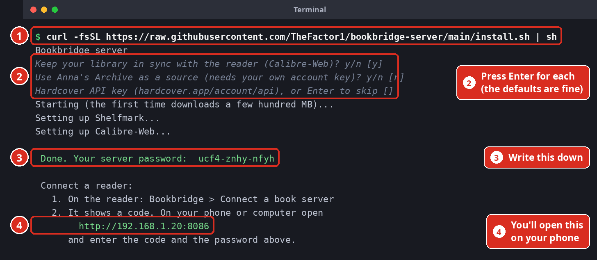
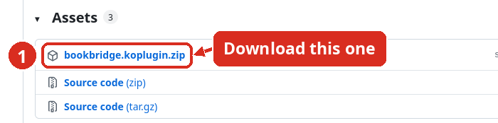
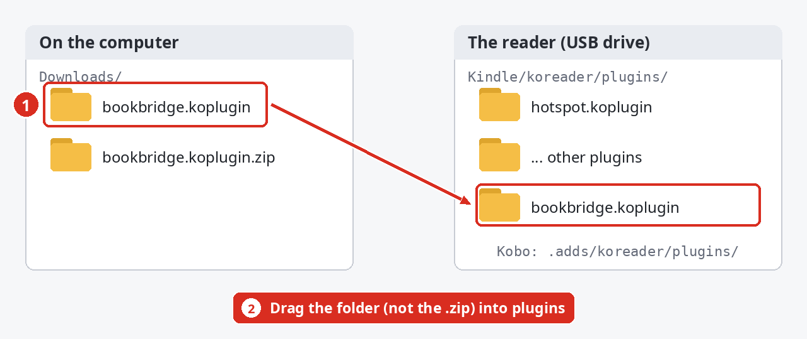
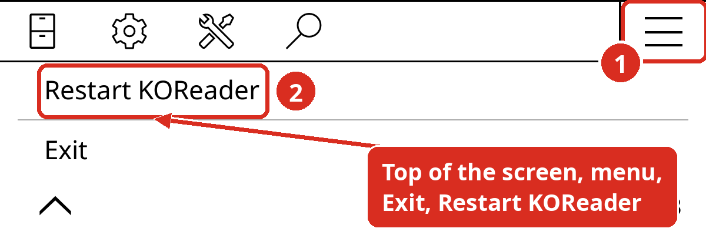
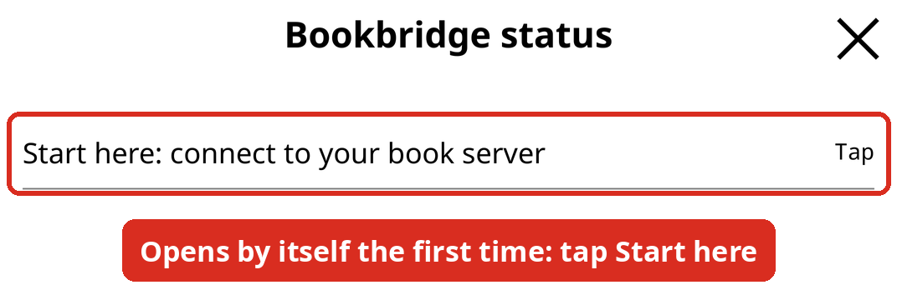
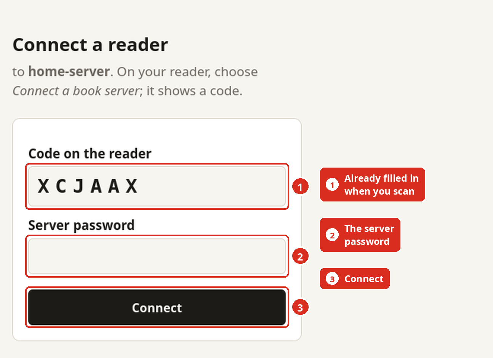
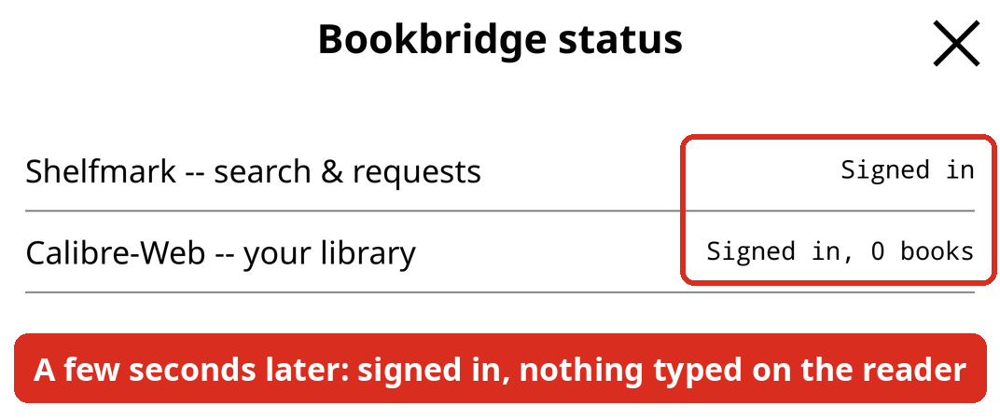
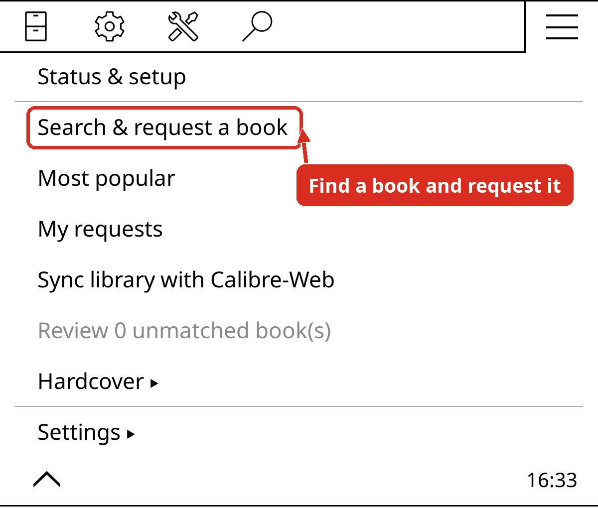

# bookbridge.koplugin

> **Written 100% by an AI.** Every line of code, every test and this document
> were written by Claude (Anthropic). I directed the work, ran every build on
> my own Kindle, Android phone and desktop KOReader, reported what I saw and
> decided what to build. No line here was hand-written by a person -- read it
> before you trust it, and treat it as you would any unaudited code.

*Formerly `shelfmark.koplugin`. Shelfmark is one of the services it connects
to, not the plugin; the name changed in September 2026. Settings and log files
keep their `shelfmark*` names, and an existing install moves itself into the
new folder on its first start after updating.*

A KOReader plugin that ties the device to a self-hosted reading stack:
[Shelfmark](https://github.com/calibrain/shelfmark) for requesting books,
Calibre-Web-Automated (CWA) for the library, and [Hardcover](https://hardcover.app)
for tracking what you read. Runs on Kindle, Android and desktop KOReader.

## Set it up, step by step

**What you need**

- A computer that stays switched on -- Linux or Mac (on Windows, use
  [WSL](https://learn.microsoft.com/windows/wsl/install)). This becomes your
  "server".
- A Kindle, Kobo or Android device with [KOReader](https://github.com/koreader/koreader)
  installed, on the same Wi-Fi as the computer.
- A phone (for scanning a code), and about 10 minutes.

*The pictures are real screenshots, with red boxes and numbers showing where
to look. Your addresses and password will differ.*

### Step 1 -- Install the server (one command)

Open a terminal on the computer (Mac: **Terminal**; Linux: your terminal
app; Windows: the **Ubuntu** app from WSL), paste this and press Enter:

```bash
curl -fsSL https://raw.githubusercontent.com/TheFactor1/bookbridge-server/main/install.sh | sh
```



It asks three questions -- pressing Enter for each is fine -- then installs
everything (and Docker too, if the computer doesn't have it yet, after asking).
The first time takes a few minutes while it downloads. At the end it prints
**your server password** and **an address** -- keep that terminal open, or
write both down.

You never have to open Shelfmark or Calibre-Web yourself: the install sets
both up with that same password. (If you want to look: their addresses are
printed too; the username is `reader`.)

### Step 2 -- Put Bookbridge on your reader

1. Download **bookbridge.koplugin.zip** from the
   [latest release](https://github.com/TheFactor1/koreader-bookbridge-plugin/releases/latest)
   (under **Assets**).

   

2. Unzip it. You get a folder called `bookbridge.koplugin`.
3. Plug the reader into the computer by USB. Drag that folder (the folder,
   not the .zip) into KOReader's `plugins` folder:
   - Kindle: `koreader/plugins`
   - Kobo: `.adds/koreader/plugins`

   

4. Eject the reader. In KOReader, tap the top of the screen, open the menu
   (the three lines at the top right), then **Exit** > **Restart KOReader**.

   

From now on Bookbridge keeps itself up to date.

### Step 3 -- Connect the reader (no typing)

1. Bookbridge opens its status screen by itself the first time. Tap **Start
   here: connect to your book server**. (Later: **Bookbridge > Connect a book
   server**.)

   

2. It finds the server on your Wi-Fi -- tap its name -- and shows a code.

   

3. Point your phone's camera at the square and open the link. The code is
   already filled in -- type the **server password** from Step 1 and tap
   **Connect**. (No phone? Open the address under the code on any computer and
   type the code yourself.)

   

4. A few seconds later the reader has everything: Shelfmark and the library
   both say **Signed in**.

   

**That's it.** Open the **Bookbridge** menu and choose **Search & request a
book**.



Another reader later? Do Steps 2 and 3 on it -- the server stays as it is.

### Extras (all optional)

Anything you'd have to type on the reader -- a key, a password -- has a
**Type on your phone** button: it shows a QR code, you paste on the phone, and
it lands in the box on the reader.

- **Hardcover** (track what you read): make a token at
  [hardcover.app/account/api](https://hardcover.app/account/api), then
  **Bookbridge > Hardcover > Hardcover settings** and paste it (or **Type on
  your phone**).
- **Away from home**: install [Tailscale](https://tailscale.com/download) on
  the computer and, on a Kindle or Kobo, the *Tailscale VPN* KOReader plugin
  (by Jadehawk), signed in to the same account. Then **Bookbridge > Connect a
  book server**, tap **Type an address instead** and enter the computer's Tailscale
  address (it starts with `100.`; the install prints it). Bookbridge finds
  Tailscale's proxy by itself.
- **Readest** (keep your place in sync with a phone or tablet): install the
  Readest KOReader plugin from its [releases](https://github.com/readest/readest/releases),
  sign in under **Tools > Readest** and turn on its auto sync.
- **Anna's Archive** (if you answered yes in Step 1): enter your Anna's
  Archive account key under **Settings > Connections > Anna's Archive
  settings**.

### If something doesn't work

| What you see | What to do |
|---|---|
| **No book server answered on this network** | Is the computer on, and the reader on the same Wi-Fi (not a guest network)? It then asks for the address: type the one the install printed (just the part like `192.168.1.20`). |
| **No reader is waiting with that code** | Codes work once, for 10 minutes. On the reader, choose **Connect a book server** again. |
| **Wrong password** on the phone page | It's the server password from Step 1 (also in `~/bookbridge-server/.env` as `BB_PASSWORD`). |
| **Can't reach** on the status screen | The computer is off or asleep, or you're away from home without Tailscale. |
| **Wrong login** | Connect again (Step 3) -- it hands over the logins afresh. |
| **Not installed** / **Not set up** | Optional -- only needed for that extra feature. |

Lost the password or the address? Run the install command again: it keeps
everything and prints both.

## What you need to host

Bookbridge is only the part on the reader. Everything it does talks to a
server you run yourself, or to an account you already have. **You need a
computer that runs Docker and stays on** -- the plugin can't replace that.
Only Shelfmark is required; each other piece switches on one feature.

| Piece | Needed? | What Bookbridge gains | Where it comes from | What you enter in Bookbridge |
|---|---|---|---|---|
| [Shelfmark](https://github.com/calibrain/shelfmark) | **Required** | Search & request books from the reader | Its own Docker image; see its README. Default port 8084 | Settings > Connections > Shelfmark: address, username, password |
| A Calibre-Web server -- [Calibre-Web-Automated](https://github.com/crocodilestick/Calibre-Web-Automated) or [Calibre-Web-NextGen](https://github.com/new-usemame/Calibre-Web-NextGen) | Optional | Library sync, downloads of delivered books | Its own Docker image. Default port 8083. Give it the **same ingest folder** Shelfmark downloads into, so requested books land in the library | Settings > Connections > Calibre-Web: address, username, password |
| [annas-archive-api](https://github.com/bitesized/annas-archive-api) | Optional | Anna's Archive as a search and download source | Its own Docker image (by bitesized). Default port 3000 | Settings > Connections > Anna's Archive: address and your Anna's Archive account key |
| An update source | Optional | Automatic updates of the plugin | Any plain web server that serves this repo's `bookbridge.koplugin/` folder (with its `manifest.json`) -- e.g. nginx pointed at a checkout | Settings > Update source |
| [Tailscale](https://tailscale.com) | Recommended | Reaching the server away from home, privately | Tailscale on the server; on a Kindle/Kobo, the Tailscale VPN KOReader plugin by Jadehawk | Nothing -- its proxy (127.0.0.1:1055) is filled in automatically |

Accounts, not servers:

- **[Hardcover](https://hardcover.app)** -- reading progress, lists, followed
  authors. Paste an API token from hardcover.app/account/api into Hardcover
  settings.
- **[Readest](https://readest.com)** -- keeps your place in sync with the
  Readest app on a phone or tablet. Install the Readest KOReader plugin
  (from [readest/readest](https://github.com/readest/readest) releases), sign
  in under Tools > Readest and turn its auto sync on. See *Readest* below.

**Easiest:** [bookbridge-server](https://github.com/TheFactor1/bookbridge-server)
installs all of the servers above with one command, sets their logins up for
you, and lets a reader connect with a code (*Connect a book server*). It also
includes the pairing relay (behind *Connect a book server*, *Set up another
device* and *Send debug log to server*) and the optional AI relay (*Match
suggestions*). See **Set it up, step by step** above.

Once it's set up, **Bookbridge > Status & setup** shows each piece, whether it
works (it really logs in -- and tests the Anna's Archive key without spending
a download), and what to tap to fix it.

## What it does

Adds a **Bookbridge** entry to KOReader's main menu.

### Requesting books
- **Search & request a book** — searches Shelfmark's metadata providers and
  submits a request from the device. **Most popular** browses what others
  are requesting; **My requests** lists yours. The book itself still arrives
  the normal way (OPDS) once CWA has imported it.

### Library sync with CWA
- **Sync library with CWA** — uploads sideloaded books to CWA, matches them
  back once imported, and offers CWA's copies of unmatched books for
  download. A file this device has already pushed is never pushed twice.
- **Send to CWA** from a book's long-press menu.

### Hardcover
- **Sync reading progress to Hardcover** *(new)* — see below.
- **Log a book** as *Currently Reading* or *Read* from its long-press menu.
- **Follow an author…** / **Followed authors…** — keep a list of authors
  and check Hardcover for their books.
- **Browse a Hardcover list…** — pick from a list and request from it.
- **Review Hardcover matches** — the books progress sync wasn't sure about.
- **Hardcover settings** — API token (from hardcover.app/account/api) and
  the edition language to prefer (default English).

### Status & setup
- The first item in the menu, and what a new device opens on its own the
  first time: one line per piece above with its state (Signed in, Wrong
  login, Can't reach, Key works, Syncing...) and the fix on tap. Saving any
  connection's settings tests that login straight away.

### Settings
- **Connections** — Shelfmark server, CWA, Anna's Archive, AI match
  suggestions, and **Advanced** (the SOCKS5 proxy and pairing relay, which
  most people never need to touch).
- **Phone clipboard** — the reader listens on port 8090. Opening
  `http://<reader>:8090` on a phone gives a page to type or paste into, and it
  lands in the box open on the reader (**Type on your phone** shows that
  address as a QR code). Share shortcuts can send `GET /clip?text=...` too.
- **Set up another device** — shows a QR code the other device scans to
  copy this one's settings (through the small pairing relay in
  `homeserver-configs/shelfmark-pairing-relay`).
- **Check for updates** — installs new builds from your own update server
  (`Update source`); the build id is in `manifest.json`.
- **Install updates automatically** (on by default once an update source is
  set) — the plugin looks at the update server quietly when the device wakes,
  gets its network back, or starts (at most once every six hours), installs a
  changed build without asking, and only asks about the restart. Nothing is
  ever checked unasked against GitHub releases.
- **View debug log** / **Send debug log to server** / **Clear log** — the plugin's own log; sending it uploads to the pairing relay for support.

## Reading progress sync (Hardcover)

Turn on **Bookbridge → Hardcover → Sync reading progress to Hardcover** with a token set.
From then on, closing a book does the work — including "closing" it from
the Bookshelf home screen, which parks the reader rather than closing it.

1. The plugin records the percentage the footer shows (the same value the
   home screen shows; it excludes front/back matter marked non-linear).
2. It identifies the book, cheapest and most certain first:
   - **the file's own identifiers** (ISBN-13/10, ASIN, or a `hardcover-id`
     written by Calibre's Hardcover plugin) — one exact query, no guessing,
     and the edition it names is your file's, so its page count is used;
   - otherwise **a title search on Hardcover**, one round trip, scored on
     author surname, normalised title, not an omnibus unless the file says
     so, an edition in your preferred language, popularity as tie-break;
   - if that isn't sure, **Open Library** is asked for the work by title and
     author and its ISBNs are put to Hardcover, which turns most ambiguous
     classics and translations into an exact hit.
   A confident match syncs silently. Anything less is parked under
   **Review Hardcover matches**, where you pick the right book (or "None of
   these" to never sync it); its progress is kept and pushed once picked.
   Opening a review entry that has no candidates asks Hardcover again first.
3. The position goes to Hardcover as *page X of Y* for the matched edition,
   and the book is marked *Currently Reading* if it wasn't. A position
   Hardcover already has is not sent again.
4. It happens silently: on an e-ink screen every notice is a flash. Long-press
   a book > **Hardcover sync status** to see where it stands. You're only
   told when something needs you -- a failure, or a match waiting for review.

Offline? The position is queued and pushed when the network comes back or
the device next wakes. Nothing runs on a timer. **Forget Hardcover book
choices** clears every match so books are decided again.

## Readest (phone & tablet sync)

Bookbridge works alongside the separate Readest KOReader plugin, which does the
syncing itself; Bookbridge fills three gaps it leaves:

- **A book you're reading goes into your Readest library.** After a few pages
  in one sitting the reader's own file is uploaded (quietly), so the phone or
  tablet opens the same bytes and progress lines up. Books already there are
  left alone.
- **Your place is saved when the device sleeps.** Readest itself only saves
  a few seconds after a page turn and on close.
- **Waking the device picks up where the phone left off**, once Wi-Fi is back.

Readest matches books by the file's exact bytes, so on the phone or tablet
open books from the Readest library, not from the Calibre-Web catalog. It only
ever moves your place forward. If the Readest plugin isn't installed or
signed in, none of this runs.

## Scope / limitations

- Built for reaching the servers directly over home WiFi or Tailscale —
  there is no handling for an interactive-login gateway (e.g. Cloudflare
  Access) in front of them.
- Shelfmark: session auth only (username/password → cookie). No OIDC/SSO.
- Hardcover progress sync matches by metadata, so a file with poor or
  wrong embedded title/author ends up in the review list rather than synced
  to the wrong book.

## Install

See **Set it up, step by step** above. Bookbridge then keeps itself up to date
from this repository's published releases (never unreleased work). To use your
own update server instead, set **Settings > Update source**.

## Development

- `tests/run-all.sh` is the gate before anything ships: matcher fixtures,
  Trapper audits, the Hardcover matching/queue/notice suites, the update
  suite, a live sync against a sandboxed CWA, and `tests/hardcover-park`
  (the real Bookshelf plugin on a desktop KOReader).
- `tools/make-manifest.sh` regenerates `manifest.json`; the gate fails on a
  stale one.
- `CHANGELOG.md` has plain-language notes per build.

## Credits

This plugin stands on other people's work:

- [KOReader](https://github.com/koreader/koreader) — the reader and its plugin
  API. Its own `wallabag.koplugin` and `opds.koplugin` were the reference for
  how a plugin should talk HTTP, and `externalkeyboard.koplugin` and the
  Trapper/UIManager code were read closely for the parts that matter here.
- [Shelfmark](https://github.com/calibrain/shelfmark) by calibrain — the
  request server this plugin exists to talk to.
- [Calibre-Web-Automated](https://github.com/crocodilestick/Calibre-Web-Automated)
  — the library it syncs with (via OPDS and the upload endpoint).
- [Hardcover](https://hardcover.app) and its public GraphQL API — reading
  progress, lists, author follows.
- [bookshelf.koplugin](https://github.com/AndyHazz/bookshelf.koplugin) by
  AndyHazz — the home screen this plugin has to coexist with; its hot-parking
  behaviour shaped how "closing a book" is detected here.
- [Anna's Archive](https://annas-archive.org) — the search the `annas`
  features use.
- [Open Library](https://openlibrary.org) (Internet Archive) — its open
  search API is the second opinion that resolves ambiguous titles to ISBNs.
- [Calibre-Web-NextGen](https://github.com/new-usemame/Calibre-Web-NextGen)
  by new-usemame — the Calibre-Web fork the author's library runs on; its
  OPDS and KOReader-sync endpoints are what Bookbridge is tested against.
- [annas-archive-api](https://github.com/bitesized/annas-archive-api) by
  bitesized — the search and download service behind the Anna's Archive
  features.
- [Readest](https://github.com/readest/readest) by chrox and contributors —
  its KOReader plugin does the phone/tablet sync; Bookbridge calls its own
  upload and sync code rather than re-implementing it.
- The Tailscale VPN KOReader plugin by Jadehawk — its local SOCKS5 proxy is
  how a Kindle reaches the server over Tailscale.

## License

[AGPL-3.0](LICENSE), the same license as KOReader.

## Authorship

**All of the code, tests and documentation in this repository were written by
an AI** (Claude, by Anthropic). Matt directed the work, tested every build on
his own Kindle, Android phone and desktop KOReader, reported what he saw, and
decided what to build and what to drop. No line here was hand-written by a
person; treat it accordingly and read before you trust.
